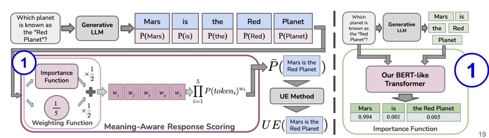

# MARS: Meaning-Aware Response Scoring (ACL 2024)

This repository provides the implementation for **MARS**: Meaning-Aware Response Scoring. Built upon the [Semantic Uncertainty Repository](https://github.com/lorenzkuhn/semantic_uncertainty), 

**Paper:** [MARS: Meaning-Aware Response Scoring (ACL 2024)](https://aclanthology.org/2024.acl-long.419.pdf)


  
## Installation

To set up the environment:

```bash
conda env create -f mars.yml
```

Add the environment’s path to your system:

```bash
export LD_LIBRARY_PATH=$LD_LIBRARY_PATH:/path_to_conda/envs/mars/lib
```

Activate the environment:

```bash
conda activate mars
```

## Importance Model

Download the pretrained importance model from this [link](https://drive.google.com/file/d/1HyhtNS2xtqJ6yKsdgnYv9lFUC-6Lcx2-/view?usp=sharing) and place `model_phrase.pth` in the `models/` directory.

Alternatively, you can train the model yourself by creating labeled datasets using the BEM model. The following commands will help you create a dataset for multiple LLMs:

```bash
python create_importance_dataset.py --model_name=mistralai/Mistral-7B-v0.1 --device=0 --dataset=trivia_qa --fraction_of_data_to_use='0.5'
python create_importance_dataset.py --model_name=tiiuae/falcon-7b-instruct --device=0 --dataset=trivia_qa --fraction_of_data_to_use='0.5'
python create_importance_dataset.py --model_name=meta-llama/Llama-2-7b-chat-hf --device=0 --dataset=trivia_qa --fraction_of_data_to_use='0.5'
python create_importance_dataset.py --model_name=meta-llama/Llama-2-7b-hf --device=0 --dataset=trivia_qa --fraction_of_data_to_use='0.5'

python create_importance_dataset.py --model_name=mistralai/Mistral-7B-v0.1 --device=0 --dataset=natural_qa --fraction_of_data_to_use='1.0'
python create_importance_dataset.py --model_name=tiiuae/falcon-7b-instruct --device=0 --dataset=natural_qa --fraction_of_data_to_use='1.0'
python create_importance_dataset.py --model_name=meta-llama/Llama-2-7b-chat-hf --device=0 --dataset=natural_qa --fraction_of_data_to_use='1.0'
python create_importance_dataset.py --model_name=meta-llama/Llama-2-7b-hf --device=0 --dataset=natural_qa --fraction_of_data_to_use='1.0'
```

Then, fine-tune a Bert-like model with the generated dataset:

```bash
python fine_tune_bert_v1.py --device=0
```

## OpenAI Setup

To run experiments, you will need an OpenAI API key. Add your key to the following line in `generate_answers.py`:

```python
openai.api_key = "your_key_here"
```

## Running Experiments

To reproduce the results from Table 1 of the paper, run the `run_framework.sh` script. It takes the following arguments:

```bash
sh run_framework.sh $model_name $run_name $gpu_no $dataset $fraction_of_data_to_use $temperature
```

### Example: TriviaQA Experiments

```bash
sh run_framework.sh tiiuae/falcon-7b-instruct trivia_qa_tiiuae-falcon-7b-instruct 0 trivia_qa 0.5 0.5
sh run_framework.sh mistralai/Mistral-7B-v0.1 trivia_qa_mistralai-Mistral-7B 0 trivia_qa 0.5 0.5
sh run_framework.sh meta-llama/Llama-2-7b-chat-hf trivia_qa_meta-llama-Llama-2-7b-chat-hf 0 trivia_qa 0.5 0.5
sh run_framework.sh meta-llama/Llama-2-7b-hf trivia_qa_meta-llama-Llama-2-7b-hf 0 trivia_qa 0.5 0.5
sh run_framework.sh meta-llama/Llama-2-13b-hf trivia_qa_meta-llama-Llama-2-13b-hf 0 trivia_qa 0.5 0.5
```

### Example: NaturalQA Experiments

```bash
sh run_framework.sh tiiuae/falcon-7b-instruct natural_qa_tiiuae-falcon-7b-instruct 0 natural_qa 1.0 0.5
sh run_framework.sh mistralai/Mistral-7B-v0.1 natural_qa_mistralai-Mistral-7B-v0.1 0 natural_qa 1.0 0.5
sh run_framework.sh meta-llama/Llama-2-7b-chat-hf natural_qa_meta-llama-Llama-2-7b-chat-hf 0 natural_qa 1.0 0.5
sh run_framework.sh meta-llama/Llama-2-7b-hf natural_qa_meta-llama-Llama-2-7b-hf 0 natural_qa 1.0 0.5
sh run_framework.sh meta-llama/Llama-2-13b-hf natural_qa_meta-llama-Llama-2-13b-hf 0 natural_qa 1.0 0.5
```

### Example: WebQA Experiments

```bash
sh run_framework.sh tiiuae/falcon-7b-instruct web_qa_tiiuae-falcon-7b-instruct 0 web_qa 1.0 0.5
sh run_framework.sh mistralai/Mistral-7B-v0.1 web_qa_mistralai-Mistral-7B-v0.1 0 web_qa 1.0 0.5
sh run_framework.sh meta-llama/Llama-2-7b-chat-hf web_qa_meta-llama-Llama-2-7b-chat-hf 0 web_qa 1.0 0.5
sh run_framework.sh meta-llama/Llama-2-7b-hf web_qa_meta-llama-Llama-2-7b-hf 0 web_qa 1.0 0.5
sh run_framework.sh meta-llama/Llama-2-13b-hf web_qa_meta-llama-Llama-2-13b-hf 0 web_qa 1.0 0.5
```

### Example: Medical QA Experiments

```bash
sh run_framework.sh AdaptLLM/medicine-chat medical_dataset_qa 0 medical_dataset 1.0 0.25
```

## Reference

If you use this code or data in your research, please cite the paper:
```bibtex
@inproceedings{bakman-etal-2024-mars,
    title = "{MARS}: Meaning-Aware Response Scoring for Uncertainty Estimation in Generative {LLM}s",
    author = "Bakman, Yavuz Faruk  and
      Yaldiz, Duygu Nur  and
      Buyukates, Baturalp  and
      Tao, Chenyang  and
      Dimitriadis, Dimitrios  and
      Avestimehr, Salman",
    editor = "Ku, Lun-Wei  and
      Martins, Andre  and
      Srikumar, Vivek",
    booktitle = "Proceedings of the 62nd Annual Meeting of the Association for Computational Linguistics (Volume 1: Long Papers)",
    month = aug,
    year = "2024",
    address = "Bangkok, Thailand",
    publisher = "Association for Computational Linguistics",
    url = "https://aclanthology.org/2024.acl-long.419",
    pages = "7752--7767",
    abstract = "Generative Large Language Models (LLMs) are widely utilized for their excellence in various tasks. However, their tendency to produce inaccurate or misleading outputs poses a potential risk, particularly in high-stakes environments. Therefore, estimating the correctness of generative LLM outputs is an important task for enhanced reliability. Uncertainty Estimation (UE) in generative LLMs is an evolving domain, where SOTA probability-based methods commonly employ length-normalized scoring. In this work, we propose Meaning-Aware Response Scoring (MARS) as an alternative to length-normalized scoring for UE methods. MARS is a novel scoring function that considers the semantic contribution of each token in the generated sequence in the context of the question. We demonstrate that integrating MARS into UE methods results in a universal and significant improvement in UE performance. We conduct experiments using three distinct closed-book question-answering datasets across five popular pre-trained LLMs. Lastly, we validate the efficacy of MARS on a Medical QA dataset. Code can be found here.",
}
```


